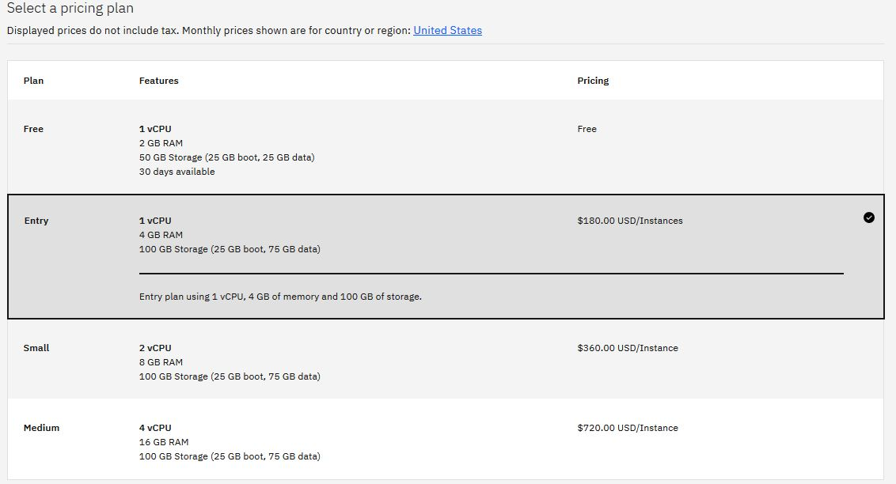

---

copyright:
  years: 2019, 2020
lastupdated: "2020-06-23"

subcollection: hp-virtual-servers

---

{:external: target="_blank" .external}
{:shortdesc: .shortdesc}
{:screen: .screen}
{:codeblock: .codeblock}
{:note: .note}
{:important: .important}
{:tip: .tip}
{:pre: .pre}

#Provisioning a virtual server
{: #provision}

You can create a virtual server by using the {{site.data.keyword.hpvs}} service from the {{site.data.keyword.cloud_notm}}.
{:shortdesc}

1. [Log in to your {{site.data.keyword.cloud_notm}} account](https://cloud.ibm.com){: external}.
2. Click **Catalog** from the menu bar and browse for the **Compute** category.
3. In the displayed selection of services, look for the **{{site.data.keyword.hpvs}}** tile. If you do not see the tile, enter `virtual server` in the search field. Then, click the tile. The {{site.data.keyword.hpvs}} page opens.

*Figure 1. Creating a virtual server*
4. In section **Select a region**, you can select the data center in which to create the virtual server instance, or you can accept the preselected default data center.
5. The **Service name** field offers a name proposal for your virtual server. You can change this name according to your conventions.
6. In the **Tags** field, you can optionally add tags to organize your resources.
7. Enter your SSH public key into the **SSH public key** field. For more information about SSH keys, see [Generating SSH keys](/docs/services/hp-virtual-servers?topic=hp-virtual-servers-generate_ssh). You can enter the public key with or without the contained comment that is either automatically generated by the SSH key generation command, or which you can optionally overwrite. The auto-generated comment contains person-related information. Therefore, any comment is removed as the first step during virtual server provisioning.
8. Select one of the available pricing plans. For initial tests, select the **Free** plan. With this plan you can have a maximum of two virtual servers at the same time (excluding expired servers). Selecting a different plan leads to fees charged by IBM.   

*Figure 2. Available pricing plans*  
{:note}
Virtual servers that are created with the **Free** plan are automatically deleted after 30 days without warning. Therefore, make sure you regularly back up important data. Deleted **Free** instances are not removed from the **Resource list**. You must delete them manually.
9. Click **Create** to provision a virtual server instance.

{:note}
As soon as you create a virtual server instance, a virtual LAN (VLAN) is transparently created or assigned. One VLAN is used within one region for one account. Each VLAN can contain up to five virtual servers per data center. A VLAN is deleted as soon as you delete the last virtual server instance that is assigned to this VLAN.

The virtual server instance appears in the **Resource list**. Using your browser's refresh function, you can check whether the instance's status has switched from **Inactive** (the server is in the process of being provisioned) to **Active** (the server is provisioned).  Due to the configuration process, provisioning can take from 5 to 30 minutes.
When your instance has a status of **Active** (provisioned), click the instance in the **Name** field to open the dashboard.
If the configuration fails, the instance status stays as **Inactive**, and if you click the instance in the **Name** field, an error message is displayed.

*Figure 3. Resource list with a virtual server showing one server being provisioned (Inactive) and one server that is already provisioned (Active)*

##Billing information
{: #billing}

When creating virtual servers by selecting a priced plan, IBM bills you on a monthly basis for each instance, independently from how long an instance exists within one month. If you delete a virtual server before the end of a month, IBM charges the fee for the complete month and then automatically stops the billing.  

 For example, if you create three instances with the Medium plan at the beginning of February 2020, and delete all of them mid of May 2020, then you are charged with 4 x 3 x 720,00 USD = 8.640,00 USD.
