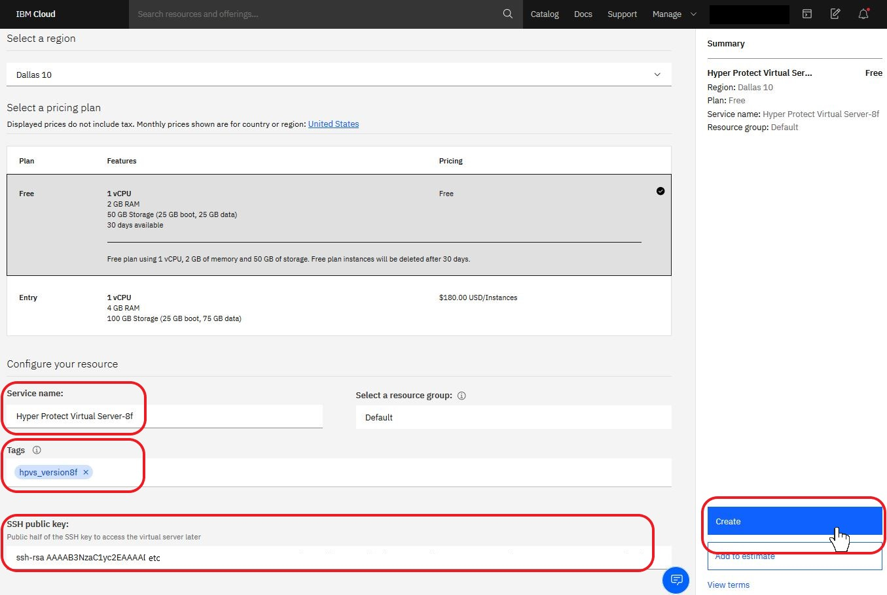

---

copyright:
  years: 2019
lastupdated: "2019-10-25"

subcollection: hp-virtual-servers

---

{:external: target="_blank" .external}
{:shortdesc: .shortdesc}
{:screen: .screen}
{:codeblock: .codeblock}
{:note: .note}
{:important: .important}
{:tip: .tip}
{:pre: .pre}

#Provisioning a virtual server
{: #provision}

You can create an instance of {{site.data.keyword.hpvs}} from the {{site.data.keyword.cloud_notm}}.
{:shortdesc}

1. [Log in to your {{site.data.keyword.cloud_notm}} account](https://cloud.ibm.com){: external}.
2. Click **Catalog** from the menu bar and navigate to the **Compute** category.
3. In the displayed selection of services, look for the **{{site.data.keyword.hpvs}}** tile. If you do not see the tile, enter `virtual server` in the search field. Then, click the tile. The {{site.data.keyword.hpvs}} page opens.

*Figure 1. Creating a **{{site.data.keyword.hpvs}}** instance*
4. The **Service name** field offers a name proposal for your server instance. You can change this name according to your conventions.
5. In the **Tags** field, you can optionally add tags to organize your resources.
6. Enter your SSH public key into the **SSH public key** field. For more information about SSH keys, see [Generating SSH keys](/docs/services/hp-virtual-servers?topic=hp-virtual-servers-generate_ssh).
7. Select the **Free Standard Plan - S** from the pricing plans. This plan is the preselected default. You can create only one virtual server with this plan.  
8. Click **Create** to provision an instance of {{site.data.keyword.hpvs}}.

{:note}
As soon as you create a virtual server instance, a virtual LAN (VLAN) is created or assigned. This VLAN is used within one availability zone for one account and may contain up to five instances. The VLAN is deleted as soon as you delete the last instance from your account.

The server instance appears in the **Resource list**. Using your browser's refresh function, you can check whether the instance's status switched from **Provision in progress** to **Provisioned** when ready. Due to configuration processes, you need to wait up to 30 minutes until you can connect to your new virtual server (HP-VS instance).

*Figure 2. Resource list with a virtual server instance*
